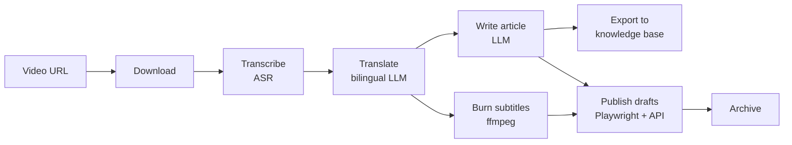

# Content Automation Pipeline — Video → Bilingual Subtitles, Article & Auto-Publish

**A fully automated workflow system I built for a content creator: drop in one video URL, and it produces bilingual subtitles, a publish-ready article, a subtitled video, and drafts posted to publishing platforms — hands-off, end to end.**

> *Case study by Ethan Sun — Senior Full-Stack & AI Engineer. Built for a client; presented anonymized — client name, brand, credentials, and paths removed. Source code is private. ("ContentFlow" is a working name for this case study.)*
> 📧 ethan@ethansun.dev · 🌐 https://ethansun.dev

---

## The problem it solves

A content creator was spending hours per video on a repetitive manual chain: download, transcribe, translate subtitles, write an article, burn subtitles, and publish to multiple platforms. Slow, error-prone, and impossible to scale.

ContentFlow turns that entire chain into a single command. One video URL goes in; finished, publish-ready assets and platform drafts come out — automatically, with each step recoverable and re-runnable.

## What it does — the full pipeline

`download → transcribe → translate → write article → export → burn subtitles → publish drafts → archive`

1. **Download** the source video, metadata, and cover image.
2. **Transcribe** speech to subtitles with an ASR model (faster-whisper).
3. **Translate** to bilingual subtitles via a multi-round LLM process — with strict line-count and timestamp preservation so timing never breaks.
4. **Write a publish-ready article** from the transcript using an LLM.
5. **Export** the article + images into the creator's knowledge base (Obsidian) automatically.
6. **Burn subtitles** into a final MP4 (ffmpeg/libass).
7. **Publish drafts** to platforms — see below.
8. **Archive** the finished task.

Every step is independent and opt-in; a SQLite-backed **state machine** drives orchestration, so any step can be retried, paused, or resumed without redoing the rest.

## Web automation & platform publishing

This is the part most relevant to automation projects:

- **Browser automation (Playwright)** — automatically logs in and creates a **draft submission on a video platform** (title, description, tags, cover, category), with cached login state and deliberate safety guards that create a *draft only* and never auto-publish.
- **Official-API publishing** — pushes a styled HTML article + cover as a **draft via the platform's official API** (token auth, idempotent re-runs).

Reliable web automation, scheduling, and resilient retries are the core of this system.

## AI / engineering highlights

- **Multi-round LLM translation** with three hard invariants: timestamps locked, line count preserved, and a deterministic fallback chain when a model call misbehaves — so output is always valid, never silently broken.
- **ASR transcription** (faster-whisper), **LLM article generation**, and a **Markdown → platform-styled HTML renderer** (custom, theme-able).
- **Provider-agnostic by design** — LLM clients, ASR backend, downloader, and ffmpeg runner are all injected, so components are swappable and fully testable.

## Architecture & tech

| Layer | Stack |
|---|---|
| **Language/runtime** | Python 3.13, uv workspace (monorepo, 7 packages) |
| **Orchestration** | Pydantic config · SQLite state machine + event log · worker pool · long-running daemon |
| **AI/Media** | faster-whisper (ASR) · OpenAI-compatible LLM APIs · ffmpeg/libass · yt-dlp |
| **Web automation** | Playwright (browser) · httpx (official platform API) |
| **CLI** | 17-command Typer interface (add, status, logs, pause/resume, retry, daemon, doctor…) |
| **Quality** | ~12,000 lines of Python · 49+ test files · dependency-injected, fully mockable steps |

**Design principle:** the ability packages (download, transcribe, translate, render, burn) never touch the database or each other — only the orchestration layer holds state. Clean, composable, and easy to extend with new steps or platforms.

## What this means for your project

The same engineering goes straight into the work you might need:

- **Web automation** — reliable Playwright/browser automation and official-API integrations for logging in, posting, scraping, and booking — with retries and safe guards.
- **End-to-end automation pipelines** — multi-step workflows with state, scheduling (daemon/cron), recovery, and clean re-runs.
- **AI integration** — ASR, LLM translation/generation, and cost-aware, provider-agnostic LLM plumbing.
- **Production-grade Python** — typed, tested, modular, documented.

**Have a manual process you want fully automated? Tell me the outcome you want — I'll tell you how to get there.**

📧 **ethan@ethansun.dev** · 🌐 **https://ethansun.dev**
